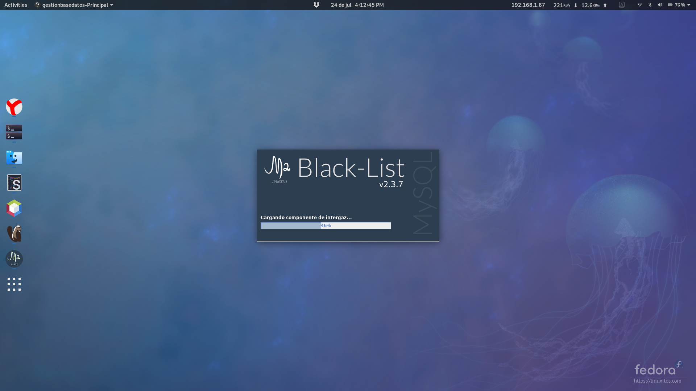
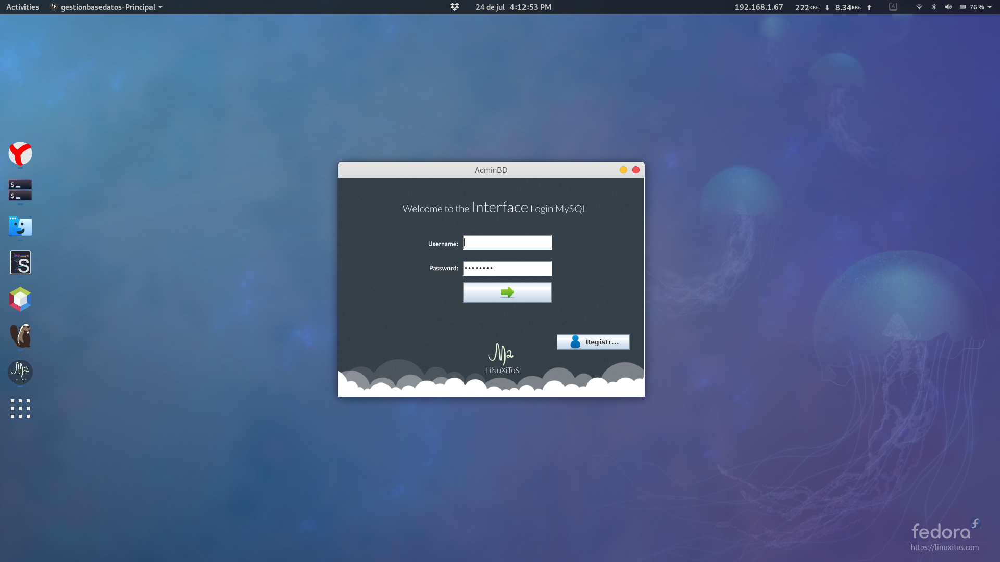
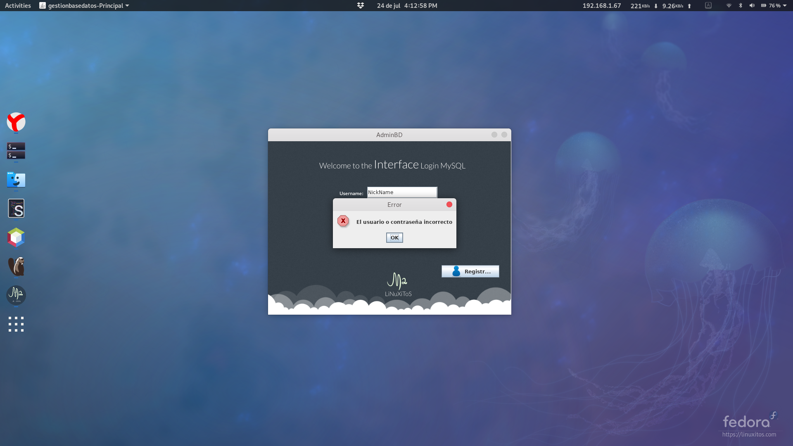
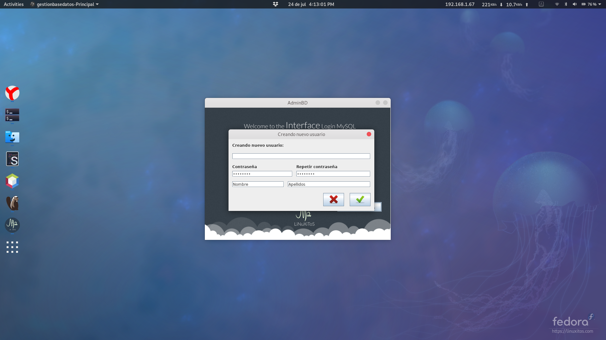
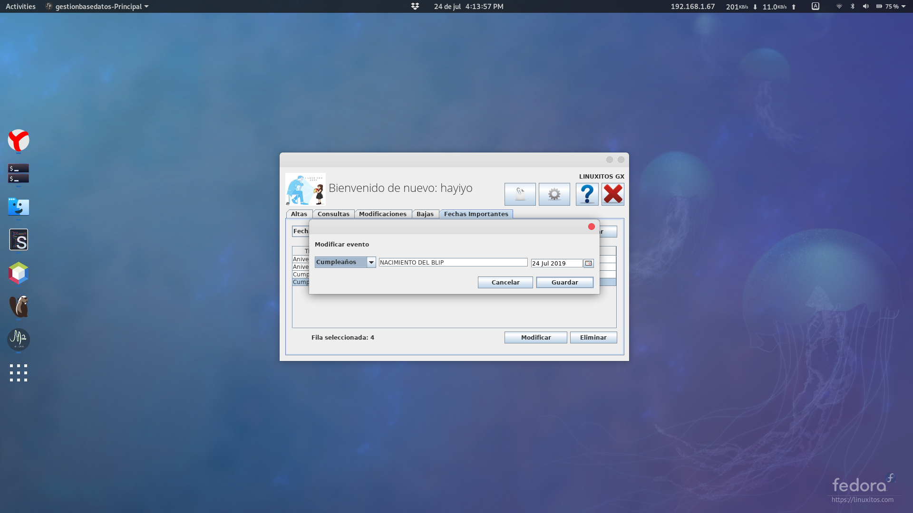
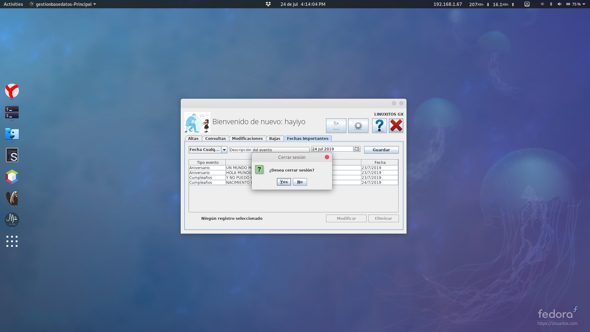

# Black-List
Black-List es un Software desarrollado en Java, para la gestion de información contenida en una base de datos en MySQL.
Black-List es software libre desarrolado por  lInuxitos; puede redistribuirlo y/omodificarlo bajo los término de la Licencia Pública General GNU tal como se publica por la Free Software Foundation; ya sea la versión 3 de la Licencia, o (a su elección) cualquier versión posterior.

Este programa se distribuye con la esperanza de que le sea útil, pero SIN NINGUNA GARANTÍA; La idea principal de este software es dar una idea de cómo utilizar los métodos para la conexión de Java con Postgresql.

Ninguno de los métodos y clases utilizadas aquí son absolutas, cualquier desarrollador las puede modificar y/o eliminar si así lo considera.

# Las caraterísticas y funciones que incluye en mini-software son:

- Guardado de fechas en MySQL
- Abrir link desde clic sobre JLabel.
- Guardado y recuperación de imágenes guardas en MySQL usando tipo de dato BLOB.
- Recuperación de las fechas y colocadas en una tabla
- Colocado de fechas en un JDateChooser
- Guardado de contraseñas encriptadas en md5 en MySQL
- Validación de usuarios a través de la contraseña encriptadas
- SplashScreen con barra de progreso modificable.
- Modificar la información del usuario en configuración de la cuenta.
- Login.
- Creación de usuarios.
- Detección al presionar enter: es decir, que cuando se presiona enter en un cuadro de texto automáticamente se ejecuta la acción correspondiente.
- Altas, bajas, modificaciones, busquedas en la BD.
- Uso de JDialog.
- Búsqueda datos mientras se escribe: es decir, se van filtrando los registros al escribir.
- Detección de la tecla scape: es decir, en algunas ventanas, se detecta la tecla scape, para indicar que se cancela la edición o modificación.
- Uso de ícono para la aplicación.
- Deshabilitar la opción del botón cerrar.
- Uso de abrir y regresar a otro jframe.
- Uso de clases.
- Uso de objetos completos.
- Manipulación de objetos como registros.
- Incluye Script de la BD.

# Información Técnica
Este software se desarrolló bajo las siguientes características:

- Versión del Software: 2.3.0
- Versión de Java: 1.8.0_91
- Versión de JDK: jdk-8u91-linux-x64
- Versión de Netbeans: 11.1
- Sistema Operativo: Fedora 30 x86_64
- Version MySQL: 8

# Capturas

